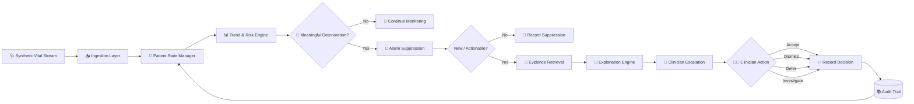

# 🩺 Sentinel Clinical Copilot

### Agentic Clinical Deterioration & Escalation Copilot

> **Real-time • Stateful • Multi-Parameter • Explainable • Human-in-the-Loop**

Sentinel Clinical Copilot is an **agentic clinical decision-support prototype** designed to identify meaningful patient deterioration from continuously changing vital signs while reducing repetitive and non-actionable alarms.

Instead of treating every abnormal vital sign as an independent alert, Sentinel maintains an evolving patient state, evaluates multiple vital-sign trends together, suppresses repeated alerts, retrieves supporting clinical context, generates an explainable escalation, and records the complete decision trail.

---

## 📌 Table of Contents

1. [Problem Statement](#-problem-statement)
2. [Solution Overview](#-solution-overview)
3. [Key Features](#-key-features)
4. [Architecture](#-architecture)
5. [Agentic Workflow](#-agentic-workflow)
6. [Project Structure](#-project-structure)
7. [Technology Stack](#-technology-stack)
8. [System Components](#-system-components)
9. [Patient State Management](#-patient-state-management)
10. [Deterioration Detection](#-deterioration-detection)
11. [Alarm Suppression](#-alarm-suppression)
12. [Evidence Grounding](#-evidence-grounding)
13. [Explainable Escalation](#-explainable-escalation)
14. [Clinician-in-the-Loop](#-clinician-in-the-loop)
15. [Audit Trail](#-audit-trail)
16. [Dashboard](#-dashboard)
17. [Installation](#-installation)
18. [Running the Application](#-running-the-application)
19. [Demo Instructions](#-demo-instructions)
20. [Testing](#-testing)
21. [Expected Demo Scenario](#-expected-demo-scenario)
22. [Troubleshooting](#-troubleshooting)
23. [Limitations](#-limitations)
24. [Future Improvements](#-future-improvements)
25. [Evaluation Alignment](#-evaluation-alignment)
26. [Submission Checklist](#-submission-checklist)

---

# 🚨 Problem Statement

Hospitals continuously collect patient information through:

* Bedside monitors
* Wearable devices
* Electronic health records
* Laboratory systems
* Clinical notes

For deteriorating patients, clinically important changes may occur between periodic assessments.

A conventional monitoring system that generates an alert whenever a single vital sign crosses a fixed threshold can create a large number of:

* False alarms
* Repetitive alarms
* Non-actionable alarms
* Duplicate notifications

This produces **alarm fatigue**, making it harder for clinicians to identify patients who genuinely require attention.

The challenge therefore requires a system capable of:

1. Processing a continuous stream of patient vitals.
2. Maintaining an evolving patient state.
3. Detecting multi-parameter deterioration.
4. Prioritising patients according to urgency.
5. Suppressing repetitive/non-actionable alarms.
6. Retrieving relevant context and clinical knowledge.
7. Generating an explainable escalation.
8. Keeping a clinician in the loop.
9. Maintaining a complete audit trail.

---

# 💡 Solution Overview

Sentinel transforms raw vital-sign streams into a structured clinical decision-support workflow.

### Core principle

```text
Abnormal Reading
       ↓
Update Patient State
       ↓
Analyze Recent Trajectory
       ↓
Check Multiple Vital Signals
       ↓
Determine Risk
       ↓
Suppress Noise / Duplicates
       ↓
Retrieve Context & Evidence
       ↓
Generate Explanation
       ↓
Escalate to Clinician
       ↓
Record Clinician Decision
```

The system does **not** simply ask:

> "Is this vital sign abnormal?"

Instead, it asks:

> "Has the patient's overall physiologic state changed meaningfully, and is the change persistent and supported by multiple signals?"

---

# ⭐ Key Features

## 1. Real-Time Vital Monitoring

Sentinel continuously processes:

* ❤️ Heart Rate
* 🫁 SpO₂
* 🫁 Respiratory Rate
* 🩸 Systolic Blood Pressure
* 🩸 Diastolic Blood Pressure

The supplied simulator produces realistic synthetic fluctuations rather than a static dataset.

---

## 2. Stateful Patient Profiles

Each patient maintains:

* Patient ID
* Display name
* Age
* Medical history
* Medication context
* Recent laboratory context
* Current vitals
* Recent vital history
* Current risk state
* Alert state
* Escalation state

---

## 3. Multi-Parameter Deterioration Detection

Sentinel evaluates combinations of:

```text
HR
SpO₂
Respiratory Rate
Blood Pressure
       +
Recent trajectory
       +
Patient context
```

This allows the system to distinguish:

```text
Single abnormal reading
        ≠
Meaningful deterioration trajectory
```

---

## 4. Risk Scoring

The prototype generates a risk score based on:

* Current vital abnormalities
* Severity
* Recent changes
* Multi-signal agreement
* Trajectory

Risk states include:

```text
LOW
MEDIUM
HIGH
```

---

## 5. Alarm Fatigue Suppression

Sentinel prevents the same clinical situation from generating repeated alerts.

It considers:

* Existing open escalations
* Previous alert timing
* Current risk state
* New information
* Patient trajectory

---

## 6. Evidence Grounding

When deterioration is detected, Sentinel retrieves relevant:

* Patient context
* Risk-pattern explanations
* Clinical knowledge
* Protocol-oriented evidence

The system therefore provides more than a numerical score.

---

## 7. Explainable Escalation

Every escalation can contain:

* Current risk level
* Risk score
* Triggering vital signs
* Trend information
* Reasoning
* Supporting evidence
* Patient context
* Recommended clinician review

---

## 8. Human-in-the-Loop

The clinician remains in control.

Supported actions include:

* ✅ Accept
* ❌ Dismiss
* ⏸ Defer
* 🔍 Investigate

---

## 9. Audit Trail

Sentinel records important events so the recommendation can be reviewed later.

The audit chain is:

```text
Observation
   ↓
State Update
   ↓
Risk Evaluation
   ↓
Suppression Decision
   ↓
Evidence Retrieval
   ↓
Escalation
   ↓
Clinician Decision
```

---

# 🏗 Architecture

## High-Level Architecture



---

# 🧩 Layered Architecture

```text
┌─────────────────────────────────────────────────────────┐
│                    SENTINEL UI                         │
│ Dashboard • Vitals • Trends • Risk • Evidence • Audit │
└──────────────────────────┬──────────────────────────────┘
                           │
┌──────────────────────────▼──────────────────────────────┐
│              CLINICAL ESCALATION LAYER                 │
│ Explanation • Recommendation • Clinician Actions       │
└──────────────────────────┬──────────────────────────────┘
                           │
┌──────────────────────────▼──────────────────────────────┐
│                 EVIDENCE / CONTEXT                     │
│ Patient Context • Risk Patterns • Clinical References  │
└──────────────────────────┬──────────────────────────────┘
                           │
┌──────────────────────────▼──────────────────────────────┐
│                RISK & TREND ENGINE                     │
│ Thresholds • Trends • Multi-Parameter Reasoning        │
└──────────────────────────┬──────────────────────────────┘
                           │
┌──────────────────────────▼──────────────────────────────┐
│                  PATIENT STATE                         │
│ Current Vitals • History • Context • Alert State       │
└──────────────────────────┬──────────────────────────────┘
                           │
┌──────────────────────────▼──────────────────────────────┐
│                 STREAM INGESTION                        │
│ HR • SpO₂ • RR • SBP • DBP                              │
└─────────────────────────────────────────────────────────┘
```

---

# 🤖 Agentic Workflow

Sentinel follows an iterative agentic workflow.

## Step 1 — Observe

A new vital-sign observation arrives.

Example:

```json
{
  "patient_id": "P104",
  "heart_rate": 118,
  "spo2": 91,
  "resp_rate": 29,
  "sbp": 134,
  "dbp": 86
}
```

---

## Step 2 — Update State

The new reading is added to the patient's history.

The system retains a rolling history so it can determine whether the patient is:

```text
Stable
    ↓
Changing
    ↓
Persistently abnormal
    ↓
Deteriorating
```

---

## Step 3 — Analyze Trends

The system compares recent readings.

For example:

```text
Earlier

HR      94
SpO₂    96
RR      21
SBP     142

          ↓

Recent

HR      118 ↑
SpO₂    91 ↓
RR      29 ↑
SBP     134 ↓
```

Several signals are changing together.

This provides stronger evidence than a single abnormal reading.

---

## Step 4 — Risk Assessment

The risk engine evaluates the patient's current state.

Example:

```text
Risk Score: 7 / 10

Risk Level: HIGH

Contributing signals:
• SpO₂ below warning range
• Respiratory rate elevated
• Heart rate elevated
• Multiple physiologic signals changing together
```

---

## Step 5 — Alarm Suppression

Before generating an escalation, Sentinel checks whether:

* An alert is already open.
* The same condition was recently reported.
* The new reading provides meaningful new information.
* The patient's trajectory has changed.

If not actionable:

```text
SUPPRESS
     ↓
Continue monitoring
     ↓
Record decision
```

---

## Step 6 — Evidence Retrieval

If escalation is warranted, Sentinel retrieves relevant evidence.

The evidence layer contains:

* Multi-parameter deterioration guidance
* Human-in-the-loop escalation policy
* Alert-noise/suppression policy
* Risk-pattern explanations
* Supporting references

---

## Step 7 — Generate Explanation

Example:

```text
HIGH PRIORITY

Multiple physiologic signals are changing together.

Triggering signals:
• Elevated heart rate
• Reduced SpO₂
• Elevated respiratory rate

Recent trajectory:
SpO₂ is decreasing while HR and RR are increasing.

Recommendation:
Clinical review recommended.

Note:
This is a decision-support signal, not an autonomous diagnosis.
```

---

## Step 8 — Clinician Decision

The clinician can:

```text
┌───────────┬───────────┬───────────┬────────────┐
│  ACCEPT   │  DISMISS  │  DEFER    │ INVESTIGATE│
└───────────┴───────────┴───────────┴────────────┘
```

---

## Step 9 — Audit

The complete workflow is recorded.

---

# 📁 Project Structure

The project is organised around the clinical copilot application.

Recommended structure:

```text
Sentinel_Clinical_Copilot/
│
├── ccp/
│   └── clinical_copilot_pro/
│       │
│       ├── app.py
│       │
│       ├── simulator.py
│       │
│       ├── engine.py
│       │
│       ├── evidence.py
│       │
│       ├── audit.py
│       │
│       └── requirements.txt
│
├── README.md
│
└── documentation/
    └── Sentinel_Clinical_Copilot_Technical_Documentation.pdf
```

### Core files

| File               | Responsibility                                    |
| ------------------ | ------------------------------------------------- |
| `app.py`           | Streamlit dashboard and application orchestration |
| `simulator.py`     | Synthetic real-time patient/vital stream          |
| `engine.py`        | Deterioration and risk analysis                   |
| `evidence.py`      | Evidence retrieval and risk-pattern matching      |
| `audit.py`         | Audit/event logging                               |
| `requirements.txt` | Python dependencies                               |

---

# 🛠 Technology Stack

## Frontend

**Streamlit**

Used for:

* Dashboard
* Patient monitoring
* Vital cards
* Charts
* Risk panels
* Clinician actions
* Audit information

---

## Backend

**Python**

Used for:

* Simulation
* State management
* Risk reasoning
* Evidence retrieval
* Alert handling
* Audit logging

---

## Data Processing

**Pandas**

Used for structured data processing and tabular analysis.

---

## Data Source

The project currently uses **synthetic patient data** for the streaming simulation.

This allows the demo to reproduce:

* Stable patients
* Normal physiologic variation
* Gradual deterioration
* Multi-parameter deterioration
* Persistent abnormal states

---

# 👥 Patient Simulation

The simulator contains a synthetic cohort.

Example patient profiles include:

```text
P101 — Stable / hypertension context
P102 — Chronic respiratory context
P103 — Low-risk baseline
P104 — Gradual deterioration scenario
```

The simulator intentionally produces different patient behaviors.

### Stable patients

Stable patients experience:

* Small fluctuations
* Mean reversion
* Natural-looking variation
* No artificial deterioration

### Deteriorating patient

The deterioration scenario gradually changes:

```text
Heart Rate       ↑
SpO₂             ↓
Respiratory Rate ↑
Blood Pressure   changes
```

This makes the demo demonstrate a **trajectory**, rather than a sudden artificial jump.

---

# 🧠 Deterioration Engine

The deterioration engine evaluates the current patient state.

Prototype risk factors include:

### SpO₂

```text
SpO₂ < 94
    ↓
Warning contribution

SpO₂ < 90
    ↓
Higher contribution
```

### Respiratory Rate

```text
RR > 24
    ↓
Warning contribution

RR > 30
    ↓
Higher contribution
```

### Heart Rate

```text
HR > 100
    ↓
Warning contribution

HR > 120
    ↓
Higher contribution
```

### Systolic Blood Pressure

```text
SBP < 90
       OR
SBP > 160
       ↓
Risk contribution
```

---

# 📈 Trend Detection

The engine also evaluates recent history.

For example:

```text
Current vs recent readings

SpO₂:
96 → 95 → 94 → 93 → 91
              ↓
        downward trend

RR:
21 → 22 → 24 → 27 → 29
              ↓
        upward trend

HR:
94 → 99 → 104 → 111 → 118
              ↓
        upward trend
```

When multiple signals change together, additional risk is assigned.

This implements the central challenge requirement of identifying a meaningful deterioration trajectory rather than reacting only to one reading.

---

# 🔕 Alarm Suppression

Alarm suppression is one of the most important components of Sentinel.

The engine maintains:

```text
open_escalations
last_alert_step
patient risk state
```

A new HIGH event does not automatically generate another notification.

A new escalation requires:

```text
HIGH risk
      +
No active escalation
      +
Alert cooldown satisfied
      +
Meaningful new information
```

This helps prevent:

```text
Reading 1 → ALERT
Reading 2 → ALERT
Reading 3 → ALERT
Reading 4 → ALERT
Reading 5 → ALERT
```

from becoming:

```text
Reading 1 → ALERT

Reading 2 → MONITOR
Reading 3 → MONITOR
Reading 4 → MONITOR

Meaningful change → NEW ALERT
```

---

# 🔎 Evidence Retrieval

The evidence layer contains structured knowledge for the prototype.

It can retrieve information related to:

* Multi-parameter deterioration
* Human-in-the-loop escalation
* Alert suppression
* Physiologic patterns
* Respiratory patterns
* Cardiovascular patterns
* Orthostatic patterns

The evidence system also provides supporting references.

### Important

Evidence retrieval supports the reasoning process.

It does **not** convert the prototype into an autonomous medical diagnostic system.

---

# 🧩 Risk Pattern Matching

Sentinel can identify patterns such as:

### Hypovolemic / septic shock pattern

```text
HR ↑
+
SBP ↓
```

The system describes this as a possible pattern requiring clinical context rather than as a diagnosis.

---

### Hypertensive / hyperadrenergic pattern

```text
HR ↑
+
SBP ↑
```

---

### Respiratory deterioration pattern

```text
SpO₂ ↓
+
RR ↑
```

---

### Acute pulmonary vascular compromise pattern

```text
SpO₂ ↓
+
RR ↑
+
HR ↑
+
SBP ↓
```

---

### Metabolic-acidosis pattern

```text
RR ↑
+
SpO₂ relatively preserved
```

The system explicitly notes that confirmation requires clinical/laboratory assessment.

---

# 🚨 Explainable Escalation

Sentinel should never expose only:

```text
Risk = 8
```

Instead, it should provide:

```text
HIGH RISK

Why?

1. SpO₂ has decreased.
2. Respiratory rate has increased.
3. Heart rate has increased.
4. Multiple signals are changing together.

Trigger:
Multi-parameter deterioration trajectory.

Evidence:
Relevant patient context and supporting knowledge.

Action:
Clinical review recommended.
```

This makes the decision traceable.

---

# 👨‍⚕️ Clinician-in-the-Loop

Sentinel intentionally does not remove the clinician from the decision process.

### Accept

Marks the escalation as acknowledged/accepted.

### Dismiss

Closes the escalation when the clinician determines that it is not actionable.

### Defer

Allows the case to remain traceable for later review.

### Investigate

Allows the clinician to inspect the supporting information.

---

# 📚 Audit Trail

The audit trail provides retrospective traceability.

Example:

```text
08:41:01
Vital reading received

        ↓

08:41:01
Patient state updated

        ↓

08:41:02
Risk engine evaluated state

        ↓

08:41:02
Multi-parameter trend detected

        ↓

08:41:02
Alert suppression check passed

        ↓

08:41:03
Evidence retrieved

        ↓

08:41:03
HIGH escalation generated

        ↓

08:41:15
Clinician investigated

        ↓

08:41:32
Clinician decision recorded
```

This is important for demonstrating that Sentinel's recommendations are reviewable after the event.

---

# 🖥 Dashboard

The Streamlit dashboard is designed around rapid clinical interpretation.

## Main areas

### Header

Displays:

* Sentinel branding
* System status
* Monitoring status

---

### Patient Overview

Displays:

* Patient ID
* Name
* Age
* History
* Medication context
* Recent laboratory context

---

### Vital Cards

```text
┌────────────┐ ┌────────────┐
│ HEART RATE │ │    SpO₂    │
│    118     │ │     91     │
└────────────┘ └────────────┘

┌────────────┐ ┌────────────┐
│ RESP RATE  │ │     BP     │
│     29     │ │  134/86    │
└────────────┘ └────────────┘
```

---

### Trend Charts

The charts show the recent trajectory of:

* HR
* SpO₂
* RR
* SBP
* DBP

The purpose is to make deterioration visible as a **trend**.

---

### Risk Panel

Displays:

```text
Risk Level
Risk Score
Triggering signals
Reasoning
Evidence
Recommendation
```

---

### Audit Panel

Displays the history of:

* Observations
* Alerts
* Actions
* Decisions

---

# 💻 Installation

## Prerequisites

Recommended environment:

```text
Windows 10/11
Python 3.10+
pip
Web browser
```

Python 3.11 or 3.12 is recommended for maximum compatibility with the project's Python dependencies.

---

# 1️⃣ Extract the ZIP

Extract the project somewhere convenient.

Example:

```text
C:\Users\<YOUR_USERNAME>\Downloads\
```

After extraction you should have the project directory.

Example:

```text
C:\Users\<YOUR_USERNAME>\Downloads\Sentinel_Clinical_Copilot\
```

---

# 2️⃣ Open PowerShell

Navigate into the project.

```powershell
cd "C:\Users\<YOUR_USERNAME>\Downloads\Sentinel_Clinical_Copilot"
```

If the `ccp` directory is present, enter it:

```powershell
cd ccp\clinical_copilot_pro
```

You should see files such as:

```text
app.py
engine.py
simulator.py
evidence.py
audit.py
requirements.txt
```

---

# 3️⃣ Verify Python

Run:

```powershell
python --version
```

or:

```powershell
python3 --version
```

Expected:

```text
Python 3.x.x
```

If `python` does not work, on some Windows installations you can try:

```powershell
py --version
```

---

# 4️⃣ Create a Virtual Environment

Recommended:

```powershell
python -m venv .venv
```

If `python` is unavailable but `py` works:

```powershell
py -m venv .venv
```

---

# 5️⃣ Activate the Virtual Environment

PowerShell:

```powershell
.\.venv\Scripts\Activate.ps1
```

If PowerShell blocks script execution, run:

```powershell
Set-ExecutionPolicy -Scope Process -ExecutionPolicy Bypass
```

Then:

```powershell
.\.venv\Scripts\Activate.ps1
```

You should see:

```text
(.venv)
```

at the beginning of the terminal prompt.

---

# 6️⃣ Install Dependencies

Run:

```powershell
python -m pip install --upgrade pip
```

Then:

```powershell
pip install -r requirements.txt
```

The current project requirements include:

```text
streamlit
pandas
```

---

# ▶️ Running the Application

From the directory containing `app.py`:

```powershell
streamlit run app.py
```

Alternatively:

```powershell
python -m streamlit run app.py
```

The second command is recommended if Windows says:

```text
streamlit is not recognized
```

---

# 🌐 Open the Dashboard

Streamlit normally displays a local URL such as:

```text
http://localhost:8501
```

Open that address in your browser.

---

# 🛑 Stopping the Application

Return to PowerShell and press:

```text
CTRL + C
```

---

# 🎬 Demo Instructions

## Demo Objective

The goal of the demo is to prove that Sentinel can:

```text
Monitor
   ↓
Maintain state
   ↓
Detect deterioration
   ↓
Suppress noise
   ↓
Explain the event
   ↓
Escalate
   ↓
Record clinician action
```

---

# Demo Step 1 — Start Sentinel

Run:

```powershell
streamlit run app.py
```

Open:

```text
http://localhost:8501
```

---

# Demo Step 2 — Show the Patient Cohort

Introduce the synthetic cohort.

Explain:

> "Sentinel is monitoring multiple synthetic patients simultaneously. Most patients show normal physiologic variation while one patient follows a gradual deterioration trajectory."

---

# Demo Step 3 — Start Monitoring

Start the simulation/monitoring controls in the dashboard.

Observe:

```text
HR
SpO₂
RR
BP
```

changing over time.

---

# Demo Step 4 — Show Stable Patients

Select a stable patient.

Explain:

> "This patient has small mean-reverting variations. The system should not generate unnecessary high-priority escalations."

This demonstrates the system's ability to avoid treating every small change as deterioration.

---

# Demo Step 5 — Show the Deteriorating Patient

Select the deterioration scenario.

Watch the trends.

You should see a gradual change such as:

```text
HR       ↑
SpO₂     ↓
RR       ↑
BP       changing
```

---

# Demo Step 6 — Show Multi-Parameter Reasoning

Open the risk panel.

Point out:

```text
Current values
      +
Recent trajectory
      +
Multiple signals
      ↓
Higher risk
```

Explain:

> "The system is not escalating because of one isolated measurement. Multiple physiologic signals are changing together."

---

# Demo Step 7 — Demonstrate Alarm Suppression

Allow additional readings to arrive while the same escalation remains active.

Explain:

> "Sentinel does not repeatedly fire the same escalation on every incoming reading. It maintains the alert state and waits for meaningful new information."

This is one of the most important parts of the demonstration.

---

# Demo Step 8 — Open Evidence

Show the evidence/context section.

Explain:

> "When Sentinel identifies a meaningful deterioration event, it retrieves supporting context and risk-pattern information so the escalation is explainable."

---

# Demo Step 9 — Demonstrate Clinician Action

Choose one:

```text
Accept
Dismiss
Defer
Investigate
```

Explain that the clinician remains responsible for the final decision.

---

# Demo Step 10 — Show the Audit Trail

Open the audit section.

Show:

```text
Observation
↓
Risk evaluation
↓
Alert
↓
Evidence
↓
Explanation
↓
Clinician action
```

Explain:

> "Every important decision can be reconstructed after the event."

---

# 🧪 Testing Strategy

The project should be demonstrated using scenario-based tests.

## Test 1 — Stable Patient

### Input

Normal fluctuations.

### Expected

```text
LOW RISK
No unnecessary escalation
```

---

## Test 2 — Single Transient Spike

### Input

One abnormal vital reading followed by recovery.

### Expected

```text
Monitor
↓
No repeated escalation
```

---

## Test 3 — Persistent Abnormality

### Input

Abnormal readings remain elevated over several observations.

### Expected

```text
Risk increases
↓
Potential escalation
```

---

## Test 4 — Multi-Parameter Deterioration

### Input

Several signals change together.

Example:

```text
HR ↑
SpO₂ ↓
RR ↑
```

### Expected

```text
HIGHER PRIORITY
+
Explainable escalation
```

---

## Test 5 — Duplicate Alert

### Input

Same condition continues after an alert.

### Expected

```text
Existing escalation maintained
+
No duplicate alert spam
```

---

## Test 6 — Clinician Dismissal

### Input

Clinician selects Dismiss.

### Expected

```text
Escalation closed
+
Decision recorded
```

---

## Test 7 — Clinician Investigation

### Input

Clinician selects Investigate.

### Expected

Relevant:

* Vital trends
* Context
* Risk reasons
* Evidence

are available.

---

# 📊 Recommended Evaluation Metrics

For a stronger final submission, report:

| Metric                   | Meaning                                                 |
| ------------------------ | ------------------------------------------------------- |
| Detection Sensitivity    | How many genuine deterioration scenarios are detected   |
| False Alert Rate         | How many non-actionable scenarios trigger escalation    |
| Duplicate Alert Rate     | How frequently the same condition is repeatedly alerted |
| Time to Escalation       | Time from deterioration onset to escalation             |
| Explanation Completeness | Whether reason, trigger and evidence are shown          |
| Audit Completeness       | Whether the complete event chain is recorded            |

---

# 🐛 Troubleshooting

## `streamlit is not recognized`

Instead of:

```powershell
streamlit run app.py
```

use:

```powershell
python -m streamlit run app.py
```

---

## `python is not recognized`

Try:

```powershell
py --version
```

Then:

```powershell
py -m venv .venv
```

---

## Virtual environment activation fails

Run:

```powershell
Set-ExecutionPolicy -Scope Process -ExecutionPolicy Bypass
```

Then:

```powershell
.\.venv\Scripts\Activate.ps1
```

---

## `requirements.txt` not found

Make sure you are inside:

```text
ccp\clinical_copilot_pro
```

Check:

```powershell
dir
```

You should see:

```text
app.py
engine.py
simulator.py
evidence.py
audit.py
requirements.txt
```

---

## Port 8501 already in use

Run:

```powershell
python -m streamlit run app.py --server.port 8502
```

Then open:

```text
http://localhost:8502
```

---

## Application opens but appears blank

Try:

```powershell
CTRL + C
```

Then restart:

```powershell
python -m streamlit run app.py
```

Also perform a browser refresh.

---

# ⚠️ Limitations

Sentinel is a **hackathon/prototype clinical decision-support system**.

It should not be presented as a production autonomous medical system.

## Synthetic Data

The streaming data is synthetic.

Therefore:

```text
Synthetic performance
        ≠
Real-world clinical effectiveness
```

---

## Clinical Validation

The prototype has not established clinical effectiveness through prospective clinical trials.

---

## Sensor Quality

Real-world systems may encounter:

* Missing measurements
* Sensor artifacts
* Incorrect timestamps
* Duplicate readings
* Device failures

---

## Evidence Quality

The quality of the generated explanation depends on the quality and relevance of the underlying evidence.

---

## Human Oversight

The clinician remains responsible for reviewing the recommendation.

---

# 🚀 Future Improvements

Possible future versions could add:

### Real Hospital Integration

```text
Bedside Monitor
      ↓
HL7 / FHIR
      ↓
Sentinel
```

---

### More Vitals

Potential additions:

* Temperature
* Heart-rate variability
* EtCO₂
* Glucose
* Other monitored signals

---

### Laboratory Integration

Connect:

```text
CBC
BMP
ABG
Lactate
Glucose
```

and other appropriate laboratory data.

---

### EHR Integration

Add:

```text
Patient history
Medications
Procedures
Clinical notes
Orders
```

---

### Advanced Models

Future versions could introduce:

* Time-series ML
* Anomaly detection
* Temporal transformers
* Patient-specific baselines
* Calibrated risk prediction

while preserving explainability and human oversight.

---

### Production Architecture

A production system could use:

```text
Message Broker
      ↓
Streaming Processor
      ↓
Patient State Store
      ↓
Risk Engine
      ↓
Evidence Retrieval
      ↓
Clinical UI
      ↓
Audit / Observability
```

---

# 🏆 Evaluation Alignment

Sentinel directly addresses the challenge requirements.

| Requirement              | Sentinel component               |
| ------------------------ | -------------------------------- |
| Real-time vital stream   | `simulator.py`                   |
| Stateful patient profile | Patient state/history            |
| Multi-parameter trends   | `engine.py`                      |
| Risk prioritisation      | Deterioration engine             |
| Alarm suppression        | Open escalation + alert cooldown |
| Evidence retrieval       | `evidence.py`                    |
| Explainable escalation   | Risk reasons + evidence          |
| Clinician in loop        | Accept/Dismiss/Defer/Investigate |
| Audit trail              | `audit.py`                       |
| Documentation            | README + technical PDF           |
| Demo                     | Streamlit dashboard              |

The official evaluation places significant emphasis on architecture/code quality, demo reasoning and output accuracy, so the README should remain synchronized with the actual final implementation.

---

# 📦 Submission Checklist

Before submitting Sentinel, verify:

## Code

* [ ] Application starts successfully
* [ ] Requirements install successfully
* [ ] No broken imports
* [ ] Dashboard loads
* [ ] Synthetic stream works
* [ ] Risk engine works
* [ ] Evidence retrieval works
* [ ] Audit logging works

## Architecture

* [ ] Architecture diagram included
* [ ] Module responsibilities documented
* [ ] Data flow documented
* [ ] Any architecture changes explained

## Testing

* [ ] Stable scenario tested
* [ ] Transient event tested
* [ ] Multi-parameter deterioration tested
* [ ] Alert suppression tested
* [ ] Clinician actions tested
* [ ] Audit trail tested

## Documentation

* [ ] README
* [ ] Technical PDF
* [ ] Setup instructions
* [ ] Demo instructions
* [ ] Limitations
* [ ] Architecture diagram

## Demo

* [ ] Problem explained
* [ ] Patient cohort shown
* [ ] Live vitals shown
* [ ] Deterioration demonstrated
* [ ] Alarm suppression demonstrated
* [ ] Reasoning demonstrated
* [ ] Evidence demonstrated
* [ ] Clinician action demonstrated
* [ ] Audit trail demonstrated

---

# 🎯 One-Minute Project Explanation

> **Sentinel Clinical Copilot is an agentic clinical decision-support system designed to reduce alarm fatigue while identifying meaningful patient deterioration. It continuously processes heart rate, SpO₂, respiratory rate and blood pressure, maintains a stateful patient profile, analyzes multi-parameter trajectories, suppresses repetitive alerts, retrieves supporting context, and generates explainable escalations for clinician review. Every recommendation remains human-controlled and auditable.**

---

# 📜 Disclaimer

Sentinel Clinical Copilot is a **prototype developed for an Agentic AI healthcare hackathon/problem statement**.

It is intended for demonstration and research purposes.

It is **not a replacement for qualified clinical judgment**, and its synthetic risk patterns and recommendations should not be interpreted as autonomous diagnosis or treatment instructions.

---

# 📚 Challenge Alignment

The official challenge requires a real-time system that processes vital streams, maintains evolving patient state, detects meaningful multi-parameter deterioration, suppresses repetitive/non-actionable alerts, retrieves grounding information, generates explainable escalation, keeps the clinician in the loop, and maintains an audit trail.

Sentinel's architecture is designed around these requirements.

**Sentinel Clinical Copilot**

> **Observe. Understand. Suppress Noise. Escalate Meaningfully. Keep Humans in Control.**
